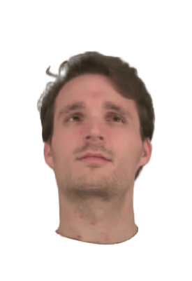

# HeadSplat

### Abstact
The creation of photorealistic 3D head avatars has become
increasingly important for applications in gaming, social
media, and online shopping, where convincing user
representations are crucial. However, achieving highquality
3D head reconstructions with minimal input data remains
a significant challenge for existing techniques, which
struggle with sparse views and lack geometric precision.
This paper presents HeadSplat, a novel approach for generating
photo-realistic 3D avatars using a generalizable
Gaussian-Splatting [4] based approach, leveraging geometrical
priors and projected features from image encoders.
Our method allows us to reduce the required inputs to as little
as two or even a single view, while maintaining visually
realistic and geometrically accurate results. Our experiments
demonstrate that HeadSplat can outperform current
state-of-the-art methods and our ablations demonstrate its
applicability to real-world applications. 



Please refer to 
```shell
3DSSL_SS24_Team1_report.pdf
```
for more details about experimental setup and project details. 

# Source
Modified repo of Gaussian Splatting and 3DSSL demo

# Installation
Either use exported environment or environment_modifed (environment_modifed might be missing one or two pip dependencies)
```shell
   conda env create -f environment_exported.yml
```

Run the steps as in the 3DSSL demo
```bash
    conda activate gaussian_splatting
    conda env config vars set CUDA_HOME=$CONDA_PREFIX
    conda activate base
    conda activate gaussian_splatting
```

Execute the demo via
```bash
    BW_IMPLEMENTATION=1 python run_gaussian_splatting.py
```
# 3DSSL-SS24_Generalizable3DHeadReconstruction
